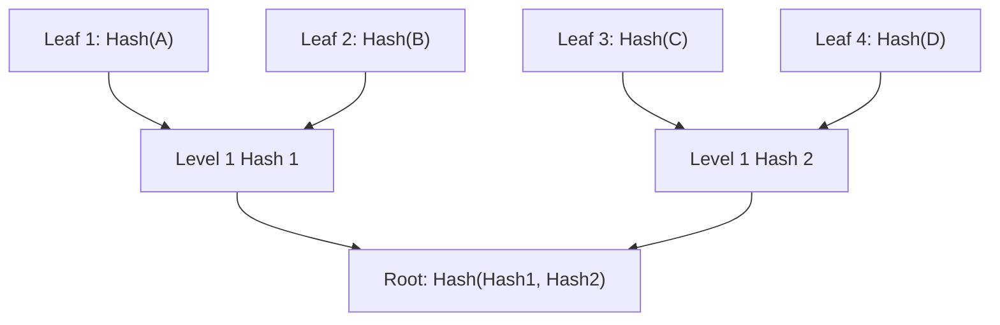

# Deep Dive into Merkle Trees with Poseidon Hashing on StarkNet

This documentation explores the construction and verification of Merkle Trees using the Poseidon hash function within the context of the StarkNet ecosystem. This guide extends beyond airdrops to include broader applications and a detailed explanation of the underlying mechanisms.

---

## 📚 What is a Merkle Tree?

A Merkle Tree is a binary tree where:

* Each **leaf node** is a hash of a data element
* Each **non-leaf node** is the hash of its two child nodes

This allows for a single root (Merkle Root) to represent a large dataset. With this root and a Merkle proof (a path of sibling hashes), anyone can verify if a data item is part of the tree **without seeing the entire data set**.

---

## 🔍 Why Poseidon for Merkle Trees?

Traditional hash functions like SHA256 are computationally expensive for zero-knowledge proofs. Poseidon is designed for **ZK-friendliness**, meaning:

* Efficient constraint systems in ZK circuits
* Smaller proof sizes
* Faster verification in SNARK/STARK systems

It is ideal for StarkNet where proofs and performance matter.

---

## Output


---


---


---


---


## 🧠 How Merkle Proofs Work

To prove a value exists in a Merkle Tree:

1. Start from the leaf (hashed data)
2. Use the provided sibling hashes to compute the hash up to the root
3. Compare the computed root with the known Merkle root

If the two roots match, the value is part of the tree.

---

## 🏗️ Tree Construction Details



* Data is encoded into felts (field elements)
* Poseidon hashes are applied pairwise up the tree
* If there’s an odd number of nodes, the last node is duplicated

---

## ⚙️ Using `starknet-merkle-tree`

### Install

```bash
npm install starknet-merkle-tree ffjavascript
```

### Example Code

```js
import * as Merkle from "starknet-merkle-tree";

const leaves = ["0xabc", "0x123", "0x456"];
const tree = Merkle.MerkleTree.create(leaves);
const root = tree.root;
const proof = tree.getProof("0x123");
```

* The `MerkleTree` handles Poseidon hashing internally
* Each leaf is converted to a field element (felt)

---

## 🧪 Cairo Contract for Verification

### Poseidon Verifier Contract

The contract imports Poseidon and provides a stateless function:

```cairo
fn verify_merkle_proof(
    leaf: felt252,
    proof: Array<felt252>,
    index: u32,
    root: felt252
) -> bool
```

### Stateless Design

* The contract **does not store the Merkle root**
* The root is passed at verification time, enabling reuse and flexibility

### Index Usage

* The `index` is used to determine the hashing order (left/right sibling)
* This maintains the tree structure and prevents collision attacks

---

## 🧮 Handling Data as Felts

In StarkNet, data is passed as `felt252`, the base type. To ensure compatibility:

* Convert JS inputs to `BigInt` using `BigInt("0x...")`
* Hash outputs from Poseidon in JS are compatible with Cairo's Poseidon

---

## 🔐 Security Considerations

* **Sorted Pairs**: Hash children in a fixed order (e.g., smaller value first)
* **No Duplicates**: Prevent multi-claim exploits
* **ZK-Friendly Hashing**: Only use Poseidon-compatible hashes for proofs

---

## 🌐 Real-World Use Cases

1. **Airdrops**: Verify claim eligibility
2. **Whitelisting**: Limit access based on proof
3. **zkRollups**: Commit off-chain state roots
4. **Private Voting**: Voter list commitments
5. **On-chain Verification of Off-chain Data**: Ensure trustless integrity

---

## ⚡ Performance Insights

Poseidon is optimized for performance:

* Linear growth in tree depth
* Efficient circuit synthesis in zero-knowledge systems
* Smaller proof sizes in ZK rollups

---

## 📁 Directory Structure

```
merkleAirdops/
├── contracts/
│   └── merkle_verifier.cairo     # Cairo contract
├── scripts/
│   └── index.js                  # Poseidon Merkle proof generator
├── README.md                     # Full documentation
├── scarb.toml                    # Scarb config for Cairo
└── package.json                  # JS dependencies
```

---

## 🧰 Tools Used

* **starknet-merkle-tree**: Poseidon-hashed Merkle trees
* **ffjavascript**: Finite field operations for hash compatibility
* **poseidon-cairo**: Native Cairo implementation of Poseidon hash
* **Scarb**: StarkNet Cairo package manager

---

## ✅ Checklist for Implementation

* [x] Build Poseidon Merkle Tree in JS
* [x] Export Merkle root and proof
* [x] Write Cairo contract to verify proofs
* [x] Ensure proof format matches JS output
* [ ] Add unit tests
* [ ] Frontend integration (React + starknet.js)
* [ ] Deploy to StarkNet testnet

---

## 🛠️ Roadmap

* Add batch verification support
* Store verified leaves to prevent double-claims
* Improve error handling in JS + Cairo
* Integrate with a frontend UI
* Extend to dynamic Merkle trees with updates

---

## 📖 References

* [Poseidon Hash Design](https://eprint.iacr.org/2019/458.pdf)
* [Merkle Trees: Explained](https://cryptobook.nakov.com/cryptographic-hash-functions/merkle-trees)
* [StarkNet Official Docs](https://docs.starknet.io/)
* [Cairo Book](https://book.starknet.io/)
* [starknet-merkle-tree GitHub](https://github.com/0xPolygonHermez/starknet-merkle-tree)

---

## 🤝 Contributing Guidelines

1. Fork this repo
2. Create a new branch
3. Write tests and docs for your changes
4. Submit a pull request with a detailed description

---

## 📜 License

This project is licensed under the MIT License.

---

## 🙏 Acknowledgements

* StarkNet OSS community
* Poseidon hash authors and implementers
* Contributors to `starknet-merkle-tree` and `poseidon-cairo`

---


